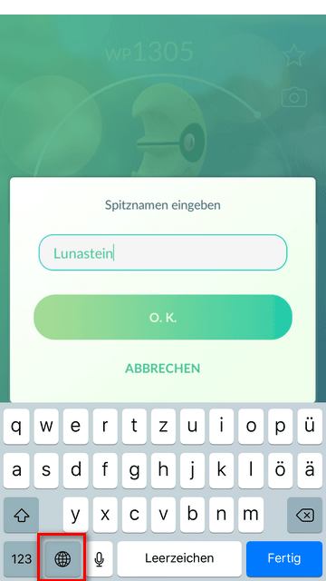

# PokeKeys

- [Installation](#installation)
- [Trainer-Level einstellen](#trainer-level-einstellen)
- [Live IV Check aktivieren](#live-iv-check-aktivieren)
- [Bekannte Probleme](#bekannte-probleme)

## Installation

1. [PokeKeys](https://itunes.apple.com/de/app/pokekeys/id1335234519?mt=8) von Victor Pavlychko installieren
2. System-"Einstellungen" öffnen
3. Das Menü "Allgemein" öffnen
4. Das Menü "Tastatur" öffnen
5. Das Menü "Tastuturen" öffnen
6. Das Menü "Tastatur hinzufügen" öffnen
7. Die Tastatur "PokéKeys" hinzufügen
8. Die Option "Vollen Zugriff erlauben" aktivieren
9. In den System-"Einstellungen" das "Kontrollzentrum" öffnen
10. Das Menü "Steuerelemente anpassen" öffnen
11. Das Element "Bildschirmaufnahme" hinzufügen
12. Die "PokéKeys" App öffnen - PokéKeys sollte jetzt aktiviert sein 

## Trainer Level einstellen

1. "Pokémon go" App öffnen und die Detailansicht eines Pokémon öffnen
2. Screenshot der Detailansicht machen
3. Bleistift zum Umbennen des Pokémons drücken
4. Tastatur auf "PokéKeys" umstellen
5. "IV Checker"-Button drücken
6. Trainer-Button drücken
7. Trainer-Level einstellen und "Set" drücken

## Live IV Check aktivieren

1. Die Entwicklung von "PokéKeys" unterstützen und damit die Pro-Features frei schalten (jede Unterstützung schaltet Pro frei)
2. Die Optionen "Enable IV Checker" und "Check IV automatically" aktivieren
3. Das Kontrollzentrum öffnen und fest auf das Aufnahme-Symbol drücken (3D Touch)
4. Die Option "Live IV Check" auswählen und "Übertragung starten" drücken
5. "Pokémon go" App öffnen - ein roter Aufnahme-Banner sollte zu sehen sein
6. Detailansicht eines Pokémon öffnen (eventuell leicht und langsam von rechts nach links wackeln) und Mitteilungen "Erlauben"
7. Banner mit Pokémon-Informationen erscheint

## Bekannte Probleme

**Banner wird nicht angezeigt**

- Überprüfen, ob eine Mitteilung von "PokéKeys" in der "Mitteilungszentrale" angezeigt wird
- Sicherstellen, dass der "Nicht Stören"-Modus ausgestellt ist (Einstellungen -> Nicht stören -> Nicht stören)
- Falls eine Apple Watch gekoppelt ist: Mitteilungsübertragung von "PokéKeys" in der "Watch"-App ausschalten (Watch -> Meine Uhr -> Mitteilungen -> PokéKeys)
- Warten bis der WP-Wert gut zu lesen ist und leicht von rechts nach links wackeln (durch den Hintergrund werden manchmal Werte verdeckt)
