# PokeKeys

- [Installation](#installation)
- [Set up trainer level](#set-up-trainer-level)
- [Enable Live IV Check](#enable-live-iv-check)
- [Known Issues](#known-issues)

## Installation

1. Install [PokeKeys](https://itunes.apple.com/app/pokekeys/id1335234519?mt=8) by Victor Pavlychko
2. Open system "Settings"
3. Open "General" menu
4. Open "Keyboard" menu
5. Open "Keyboards" menu
6. Open "Add New Keyboard" menu
7. Add "PokéKeys" keyboard
8. Enable "Allow Full Access"
9. Open "Control Centre" in system "Settings"
10. Open "Customise Controls" menu
11. Add "Screen Recording" item
12. Open "PokéKeys" app - PokéKeys should be activated

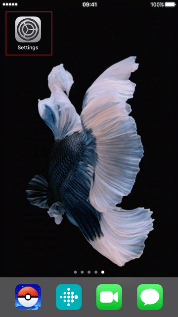

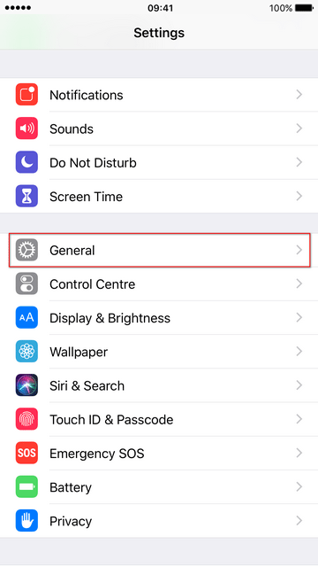

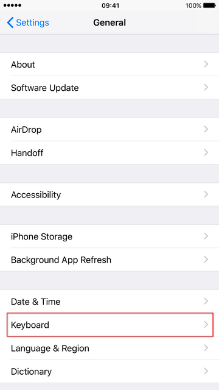

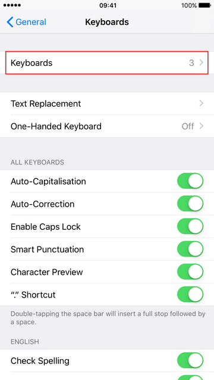

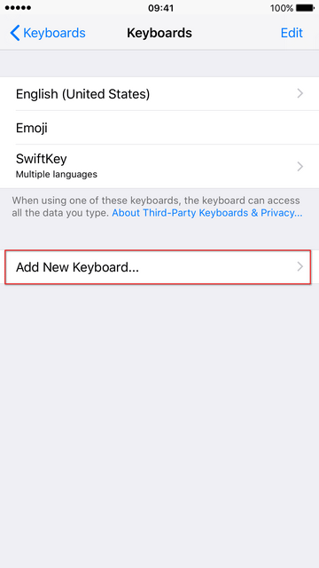

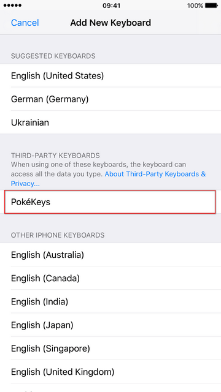

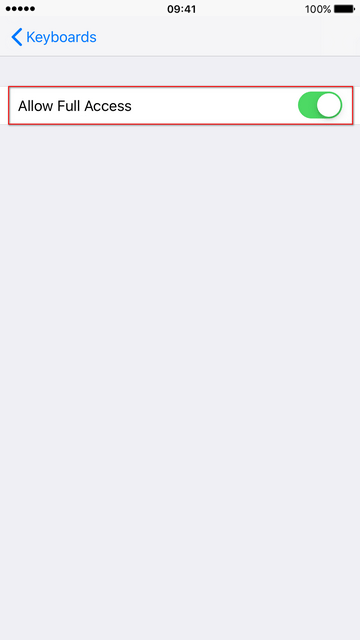

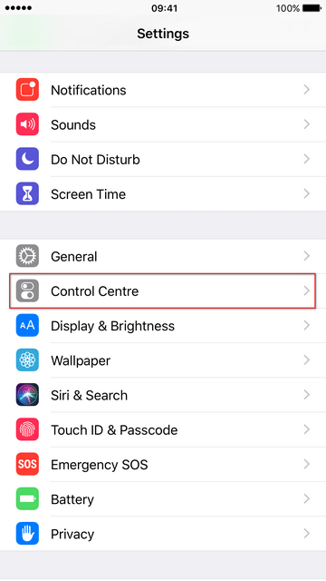

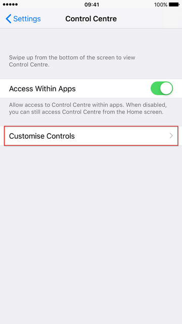

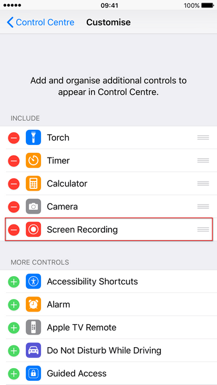

## Set up trainer level

1. Open "Pokémon go" app and open the detail view of a Pokémon
2. Take a screenshot of the detail view
3. Press the pencil to edit the Pokémons name
4. Change the keyboard to "PokéKeys"
5. Press the "IV Checker" button
6. Press the trainer button
7. Set your trainer level and press "Set"

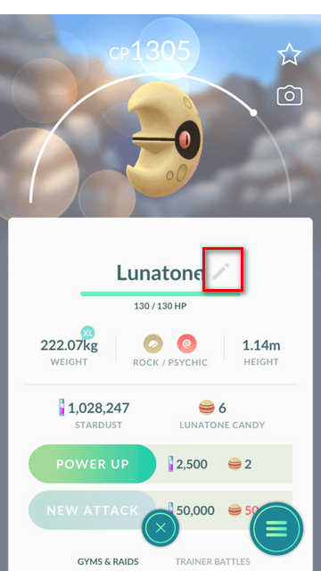

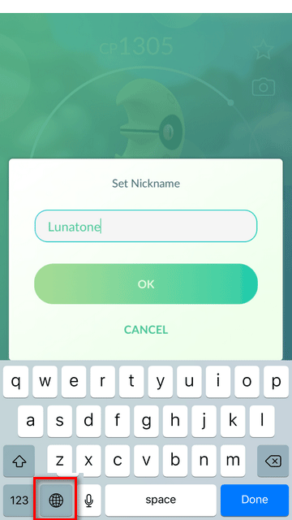

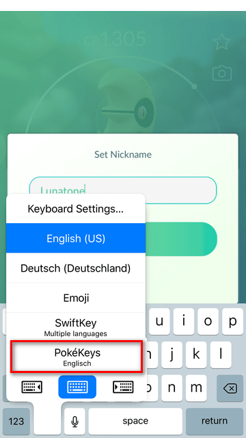

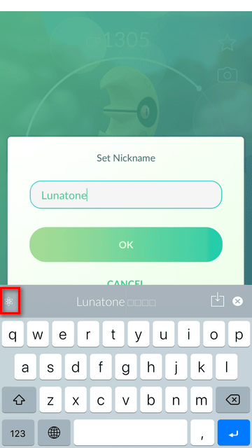

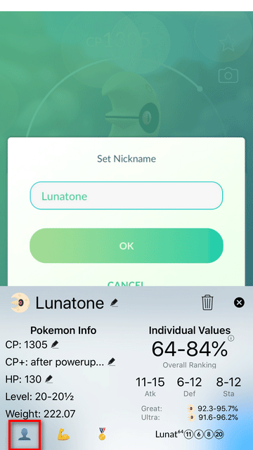

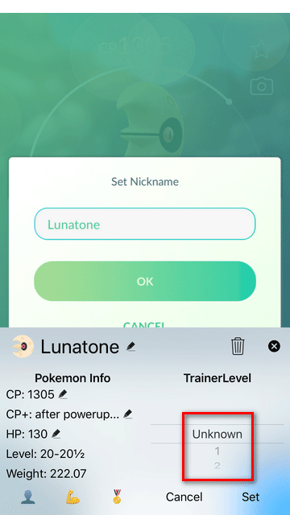

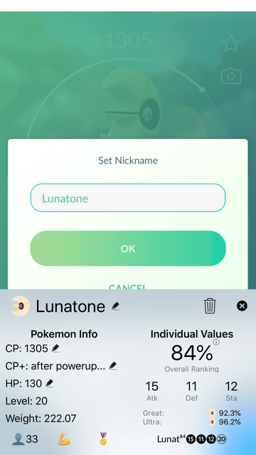

## Enable Live IV Check

1. Support the development of "PokéKeys" and unlock pro features (every option unlocks pro)
2. Enable "Enable IV Checker" and "Check IV automatically"
3. Open Control Centre and press screen recording button (3D Touch)
4. Activate "Live IV Check" and press "Start Broadcast"
5. Open "Pokémon go" app - a red banner should appear to signalise screen recording
6. Open the detail view of a Pokémon and "Allow" notifications (you may need to slightly nudge the screen)
7. Banner with Pokémon information appears

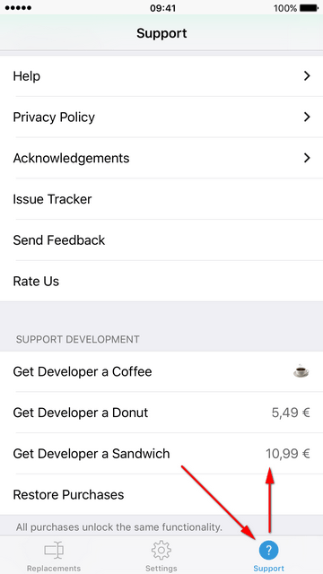

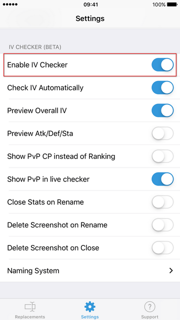

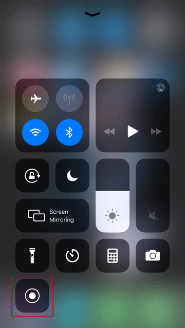

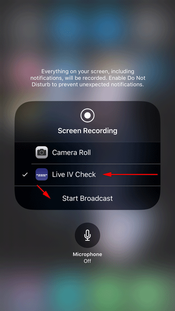

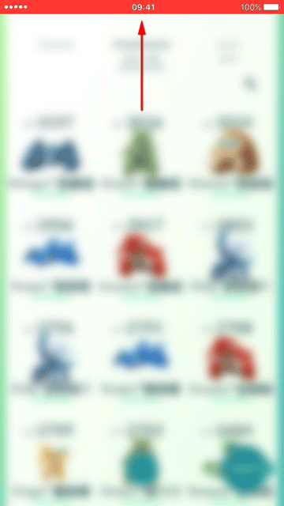

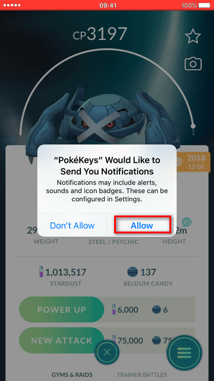

## Known Issues

**Banner is not shown**

- Check if a notification from "PokéKeys" is visible in the "Notification Centre"
- Ensure "Do Not Disturb" mode is deactivated (Settings -> Do Not Disturb -> Do Not Disturb)
- If an Apple Watch is paired: disable notifications from "PokéKeys" in the "Watch" app (Watch -> My Watch -> Notifications -> PokéKeys)
- Wait until CP value is visible and slightly nudge the screen (sometimes the background makes values hard to read)
